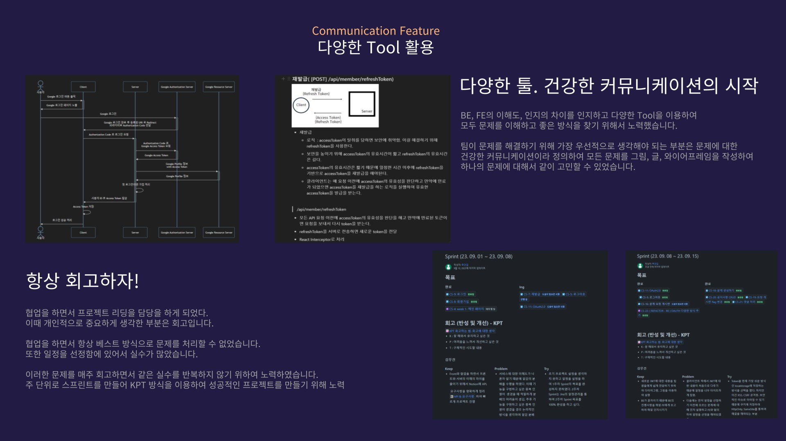
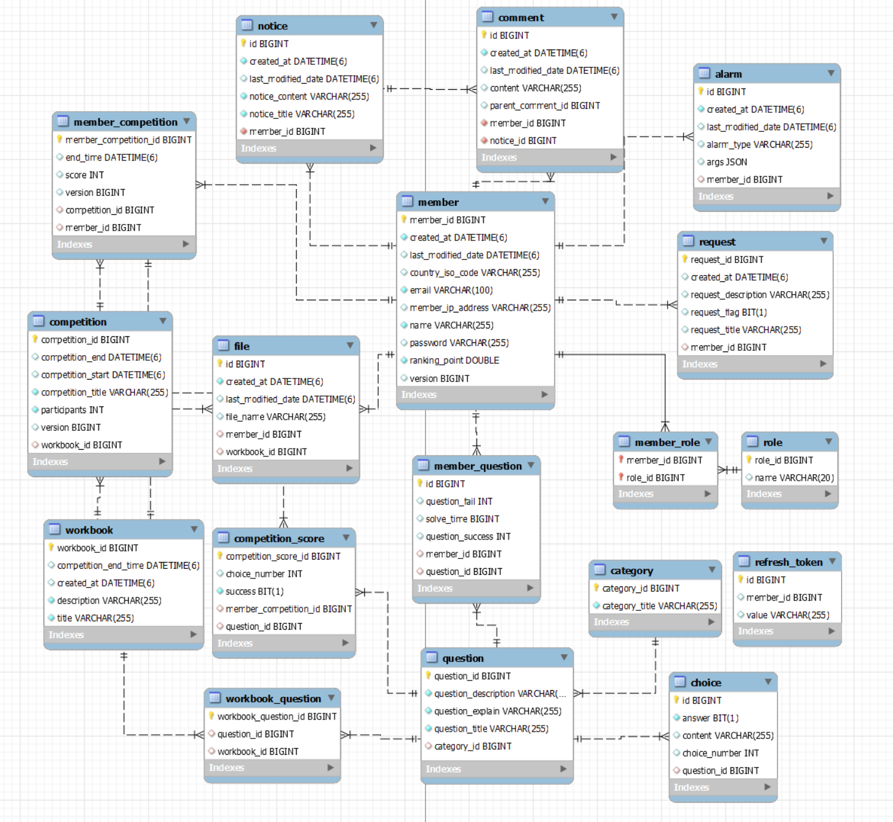
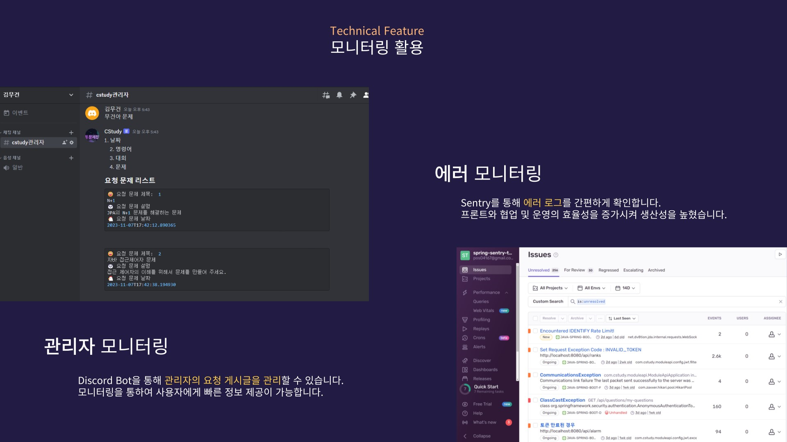
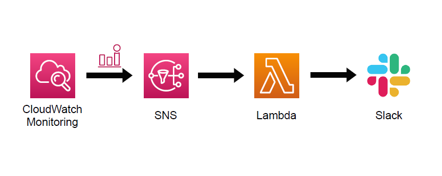
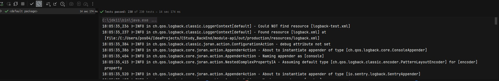
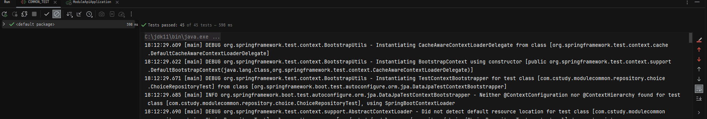
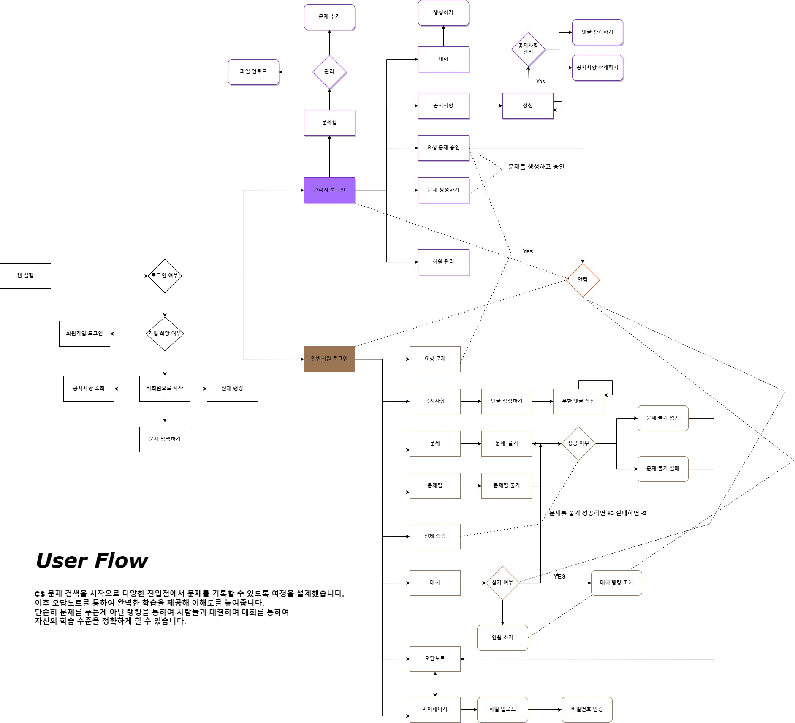
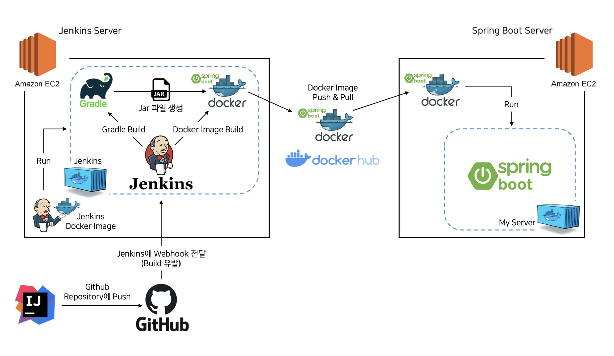
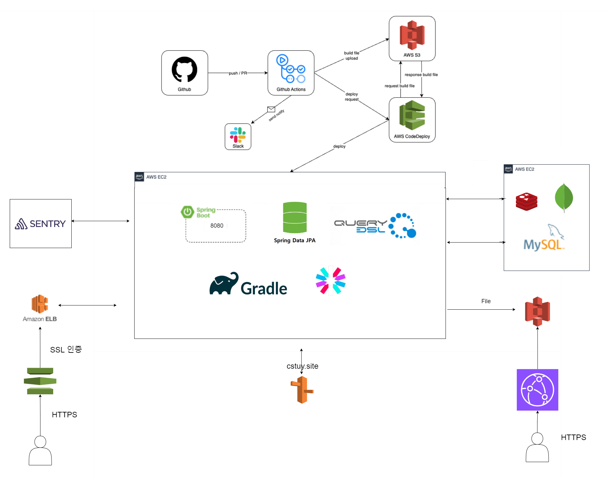

# 📖 취업 CS 걱정하지마, CS;tudy

### ~~📢 [배포 사이트 바로가기 - [ 바로가기 ]](https://cstudying.site/)~~

 

| ``2023. 10`` ~ ``2023.12``
- 비용 문제로 ``23. 12. 18``이후로 비활성화합니다.

## ✨ 프로젝트 소개

### [ 프로젝트 간단 소개 ]

- 취업에 있어 필요한 CS 지식을 학습할 수 있는 웹 어플리케이션 플랫폼 입니다. 카테고리 별 문제를 통해 필요한 지식을 빠르게 학습할 수 있으며 틀린 문제를 모아서 부족한 부분을 빠르게 인지할 수 있습니다. 또한
  경쟁을 통하여 지루한 CS 학습에 재미를 부여하며 선의의 경쟁을 통해 동료와 함께 성장이 가능합니다.

   

### [ 프로젝트를 처음 기획을 생각한 이유 ]

- 국비지원에서 프로젝트 [IPMS](https://github.com/KMGeon/IPMS)를 만들고 아쉬움을 가지게 되었습니다. 모든 팀원이 포트폴리오를 위하여 만들었기 때문에 실제 서비스를 하기에 적절한 도메인이 아니라고 판단하여 새로운 서비스를 만들겠다고 생각을 했습니다.
- 취업을 준비하면서 학과에서 배운 CS 공부가 재미도 있지만 단순히 Github의 정리, 동영상, 책을 통해서 학습하여 지루함을 느끼게 되었고, 이를 개선하고자 문제를 풀어 재미있게 학습하는 서비스를 만들고자 생각을 했습니다.

 

### [ 처음만난 사람들을 리딩하여 성공적으로 프로젝트를 완성할 수 있었던 이유 ]

- 프로젝트를 하면서 `협업`을 가장 중요하게 생각을 하였습니다. `클라이언트`와 `서버`의 이해도, 인지의 차이가 있다고 생각하여 최대한 간단하게 설명 ( 글, 그림을 통하여 )하고, 이를 기반으로 긍정적인 커뮤니케이션을 하기 위하여 노력하였습니다.

 

## 👨‍기술 스택

<h3 align="center">어플리케이션</h3>

<h3 align="center">DB</h3>

  

<h3 align="center">인프라</h3>

   

<h3 align="center">문서 / 협업</h3>

   

 

## 🎨 ERD Diagram

 

## 🖥 모니터링

[ 현재 서비스 운영 문제점 ] 
- 서버를 운영하면서 CPU 100%가 되어서 시스템의 오류가 발생.
- 서버 비용의 문제로 인하여 확장성이 부족한 EC2에 DB 설치하여 운영.
- DB 서버가 CPU 100%가 되면 서비스 오류, 새벽 2시에 Redis Backup을 수행하지 못하는 문제 발생

[ 현재 문제 개선 ] 
- 현재는 이 문제를 해결하기 위하여 메모리 Swap, EC2 버스트 현상의 Credit 부족을 막기 위하여 인스턴스 유형 변경, Stop & Start 방식으로 문제 해결
- Stop & Start 방식을 수행하면서 모니터링의 중요성이 증가하여 이를 자동화 하기 위하여 `CloudWatch`, `Lambda`, `Slack`을 이용하여 자동화 변경

[ 개선해야 되는 부분 ] 
- 알림을 통하여 자동화를 하여도 현재 Stop & Start 방식을 사용하기 때문에 재시작을 해야되는 문제
- 이를 개션하기 위하여 Lambda Trigger를 통하여 Stop & Start 방식의 문제점을 개선 필요
- Lambda를 통하여 Stop & Start의 문제를 해결하여도 재시작하는 동안 서비스가 잠시 사용하지 못한다. 이를 해결하기 위하여 분산 환경으로 변경을 해야된다.
  

 

## 🐧Test Code

### Controller

- 테스트 코드는 단순히 데이터의 정합성을 검증하는 로직이 아니라 내 코드를 읽는 상대방에게 설명하는 코드라고 생각합니다.
- ``Controller``의 테스트는 Mock을 통하여 HTTP 요청, 검증에서 책임, 주요 관심사를 분리하여 ``요청,검증``을 분리를 하였습니다.

### Service

``Service Layer Test``의 경우에 Test Double(Mocking)을 통하여 테스트를 진행을 하였을 때 Repository의 인터페이스가 변화를 하면 실패를 한다.

- 단위 테스트에서 Mocking을 하면 연관 관계의 ``인터페이스와 강하게 의존``하여 리펙토링을 어렵기 때문에 Classic 방식을 통하여 테스트를 진행을 하였습니다.
- 제어할 수 없는 코드인 경우에만 Test Double을 사용을 하였습니다.
- ``LocalDateTime.now()``의 테스트 코드는 항상 일관성을 보장하기 힘들어 Service에 변수를 넘겨주는 방식으로 변경

 

## 📋 API 문서 - [문서 보기](https://documenter.getpostman.com/view/23650109/2s9YXk41jC)

 

## 📕CStudy의 여정의 기능을 소개할게요.

 

## 🏛️ CI/CD 아키텍처 (배포 자동화)

### 1. 기존에 Jenkins를 통하여 배포 자동화

블로그 : [Jenkins Pipeline을 이용한 CI/CD + SSHAgent](https://pos04167.tistory.com/195)

- 처음 배포를 선택한 `파이프라인`입니다. 이때 Jenkins를 선택한 이유는 스터디를 통하여 Jenkins를 학습한 경험이 있어 다른 2개의 기술보다 러닝커브가 낮다고 생각하여 적용을 하였습니다.
- Jenkins를 통하여 배포의 문제점은 트래픽이 증가를 하였을 때 Auto Scailing을 처리하기 위해 추가적인 작업이 필요하여 스프링 부트와 AWS로 혼자 구현하는 웹 서비스의 무중단 배포로 구조를 변경을
  했습니다.

### 2. 현재 배포의 구조 / 선택한 이유 (Github Action 배포 자동화 변경)

블로그 : [Github Actions CI + CodeDeploy로 CI/CD 구현하기](https://velog.io/@geon_km/Github-Actions-CI-CodeDeploy%EB%A1%9C-CICD-%EA%B5%AC%ED%98%84%ED%95%98%EA%B8%B0-vum9u82d)

[ 현재 문제 ]

- SSE를 추가하면서 분산 환경에 대한 제약사항이 발생을 하였습니다.
- 이러한 문제로 WAS를 1개만 사용하게 변경

[ 현재 적용 ]

- Git과 연동성이 좋은 Github Action을 통한 배포 자동화로 변경을 했습니다.
- 변경한 이유는 가장 간단하게 배포 자동화를 구성할 수 있었고, 제한된 Resource를 통하여 최대의 효율로 관리가 가능하다. ( Action만 사용하여 파이프라인 효율적 관리, 배포 성공시 알람이 나오는
  ChatOps를 통해 서비스 오류에 빠르게 대응이 가능하다. )

[ 변경을 생각하는 부분 ]

- 현재 SSE의 확장성을 생각하여 메세지(Kafka)를 적용하여 AWS 고가용성 아키텍처를 사용하여 배포를 고려하고 있습니다.

 

## 🥃 Wireframe

[📝 Figma 바로가기 ](https://www.figma.com/file/67asFaSpQCu4s2CKAJqxac/Untitled?type=design&node-id=0-1&mode=design&t=DdRtY5ictOvnNkSn-0)

