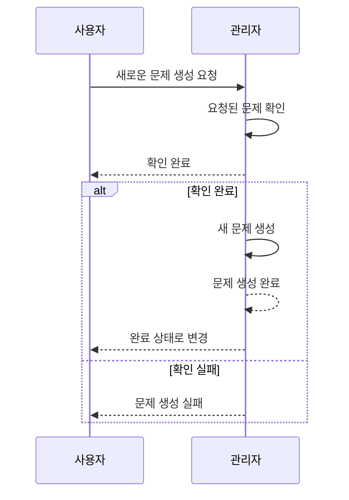
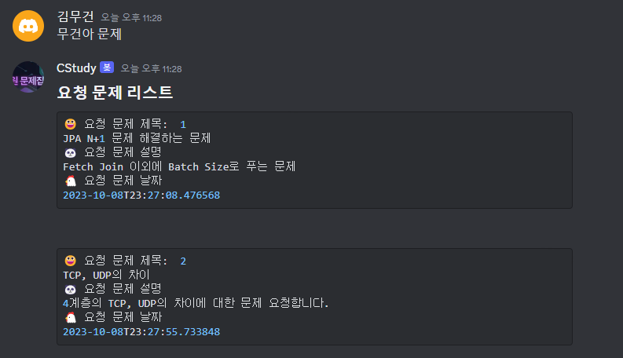
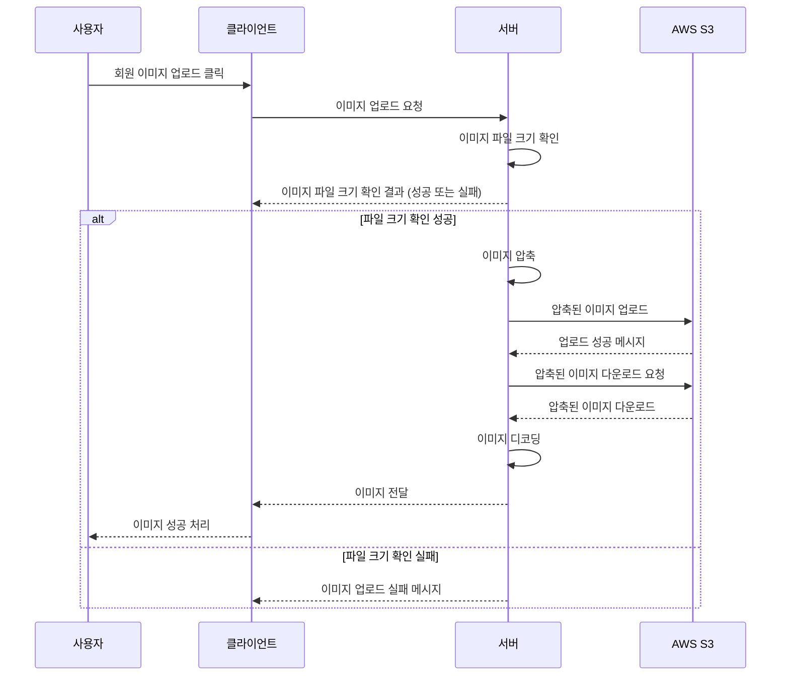

# 📖 취업 CS 걱정하지마, CS;tudy

<br>

## ✨ 프로젝트 소개
``` Introduce ```
- 취업에 있어 필요한 CS 지식을 학습할 수 있는 웹 어플리케이션 플랫폼 입니다. 카테고리 별 문제를 통해 필요한 지식을 빠르게 학습할 수 있으며 틀린 문제를 모아서 부족한 부분을 빠르게 인지할 수 있습니다.  또한 경쟁을 통하여 지루한 CS 학습에 재미를 부여하며 선의의 경쟁을 통해 동료와 함께 성장이 가능합니다.


  
- 기존에 팀 프로젝트를 진행을 하면서 같이 개발을 진행을 하던 팀원이 취업을 하여 실제 서비스를 만들기 위해 프로젝트를 고도화를 진행을 했습니다. 이전에 진행한 프로젝트 [1차 개발 프로젝트](https://github.com/CStudyTeam)


<br/>

## 🥕프로젝트 백엔드 의사결정 및 이슈

### 최적화
- [실행 계획 분석을 통한 인덱스 추가 및 QueryDSL 페이징 쿼리 성능 튜닝 58.20% 개선](https://github.com/CS-tudy/CStudy_BackEnd/wiki/%EC%8B%A4%ED%96%89-%EA%B3%84%ED%9A%8D-%EB%B6%84%EC%84%9D%EC%9D%84-%ED%86%B5%ED%95%9C-%EC%9D%B8%EB%8D%B1%EC%8A%A4-%EC%B6%94%EA%B0%80-%EB%B0%8F-QueryDSL-%ED%8E%98%EC%9D%B4%EC%A7%95-%EC%BF%BC%EB%A6%AC-%EC%84%B1%EB%8A%A5-%ED%8A%9C%EB%8B%9D-58.20%25-%EA%B0%9C%EC%84%A0)
- [문제 Bulk Insert 문제를 Recursion(재귀)에서 Batch Insert으로 10,000건 데이터 1440초에서 105초 성능 개선](https://github.com/CS-tudy/CStudy_BackEnd/wiki/%EB%AC%B8%EC%A0%9C-Bulk-Insert-%EB%AC%B8%EC%A0%9C%EB%A5%BC-Recursion(%EC%9E%AC%EA%B7%80)%EC%97%90%EC%84%9C-Batch-Insert%EC%9C%BC%EB%A1%9C-10,000%EA%B1%B4-%EB%8D%B0%EC%9D%B4%ED%84%B0-1440%EC%B4%88%EC%97%90%EC%84%9C-105%EC%B4%88)
- [AWS S3 이미지 파일 Deflater 활용하여 압축을 통해서 JPG 기준 이미지 16.01% 크기 감소 ](https://github.com/CS-tudy/CStudy_BackEnd/wiki/AWS-S3-%EC%9D%B4%EB%AF%B8%EC%A7%80-%ED%8C%8C%EC%9D%BC-Deflater-%ED%99%9C%EC%9A%A9%ED%95%98%EC%97%AC-%EC%95%95%EC%B6%95%EC%9D%84-%ED%86%B5%ED%95%B4%EC%84%9C-JPG-%EA%B8%B0%EC%A4%80-%EC%9D%B4%EB%AF%B8%EC%A7%80-16.01%25-%ED%81%AC%EA%B8%B0-%EA%B0%90%EC%86%8C)

### 프로젝트 진행 이슈
- [CS 문제에 대한 번호를 선택을 하여 7개의 데이터 정합성 체크](https://github.com/CS-tudy/CStudy_BackEnd/wiki/CS-%EB%AC%B8%EC%A0%9C%EC%97%90-%EB%8C%80%ED%95%9C-%EB%B2%88%ED%98%B8%EB%A5%BC-%EC%84%A0%ED%83%9D%EC%9D%84-%ED%95%98%EC%97%AC-7%EA%B0%9C%EC%9D%98-%EB%8D%B0%EC%9D%B4%ED%84%B0-%EC%A0%95%ED%95%A9%EC%84%B1-%EC%B2%B4%ED%81%AC)
- [IP 기반 유저 블랙리스트 추가](https://github.com/CS-tudy/CStudy_BackEnd/wiki/IP-%EA%B8%B0%EB%B0%98-%EC%9C%A0%EC%A0%80-%EB%B8%94%EB%9E%99%EB%A6%AC%EC%8A%A4%ED%8A%B8-%EC%B6%94%EA%B0%80)
- [FE & BE 운영 및 테스트를 위하여 Logback Rolling FileAppendar 적용 및  Slack Webhook 도입](https://github.com/CS-tudy/CStudy_BackEnd/wiki/FE-&-BE-%EC%9A%B4%EC%98%81-%EB%B0%8F-%ED%85%8C%EC%8A%A4%ED%8A%B8%EB%A5%BC-%EC%9C%84%ED%95%98%EC%97%AC-Logback-Rolling-FileAppendar-%EC%A0%81%EC%9A%A9-%EB%B0%8F--Slack-Webhook-%EB%8F%84%EC%9E%85)
- [Exception을 추상 클래스을 활용하여 응집도 증가 및 Front와 협업을 위해 Custom Error Status 생성](https://github.com/CS-tudy/CStudy_BackEnd/wiki/Exception%EC%9D%84-%EC%B6%94%EC%83%81-%ED%81%B4%EB%9E%98%EC%8A%A4%EC%9D%84-%ED%99%9C%EC%9A%A9%ED%95%98%EC%97%AC-%EC%9D%91%EC%A7%91%EB%8F%84-%EC%A6%9D%EA%B0%80-%EB%B0%8F-Front%EC%99%80-%ED%98%91%EC%97%85%EC%9D%84-%EC%9C%84%ED%95%B4-Custom-Error-Status-%EC%83%9D%EC%84%B1)

### 리펙토링

- [전략 패턴을 사용하여 Param에 따른 서비스 호출 및 개별 컴포넌트 분리](https://github.com/CS-tudy/CStudy_BackEnd/wiki/%EC%A0%84%EB%9E%B5-%ED%8C%A8%ED%84%B4%EC%9D%84-%EC%82%AC%EC%9A%A9%ED%95%98%EC%97%AC-Param%EC%97%90-%EB%94%B0%EB%A5%B8-%EC%84%9C%EB%B9%84%EC%8A%A4-%ED%98%B8%EC%B6%9C-%EB%B0%8F-%EA%B0%9C%EB%B3%84-%EC%BB%B4%ED%8F%AC%EB%84%8C%ED%8A%B8-%EB%B6%84%EB%A6%AC)
- [Redis 자료구조 랭킹 시스템 도입 및 캐싱 오버헤드를 고려하여 Redis Pub/Sub 캐싱 정합성](https://github.com/CS-tudy/CStudy_BackEnd/wiki/Redis-%EC%9E%90%EB%A3%8C%EA%B5%AC%EC%A1%B0-%EB%9E%AD%ED%82%B9-%EC%8B%9C%EC%8A%A4%ED%85%9C-%EB%8F%84%EC%9E%85-%EC%BA%90%EC%8B%B1-%EC%98%A4%EB%B2%84%ED%97%A4%EB%93%9C%EB%A5%BC-%EA%B3%A0%EB%A0%A4%ED%95%98%EC%97%AC-Redis-Pub-Sub-%EC%BA%90%EC%8B%B1-%EC%A0%95%ED%95%A9%EC%84%B1)
- [테스트 코드를 통하여 코드 안전성 검증 및 Test Double 사용하며 컨트롤 할 수 없는 코드 영향 최소화](https://github.com/CS-tudy/CStudy_BackEnd/wiki/%ED%85%8C%EC%8A%A4%ED%8A%B8-%EC%BD%94%EB%93%9C%EB%A5%BC-%ED%86%B5%ED%95%98%EC%97%AC-%EC%BD%94%EB%93%9C-%EC%95%88%EC%A0%84%EC%84%B1-%EA%B2%80%EC%A6%9D-%EB%B0%8F-Test-Double-%EC%82%AC%EC%9A%A9%ED%95%98%EB%A9%B0-%EC%BB%A8%ED%8A%B8%EB%A1%A4-%ED%95%A0-%EC%88%98-%EC%97%86%EB%8A%94-%EC%BD%94%EB%93%9C-%EC%98%81%ED%96%A5-%EC%B5%9C%EC%86%8C%ED%99%94)
- [랭킹 참가 낙관적 락을 이용해 동시성 문제를 통한 중복요청 제어](https://github.com/CS-tudy/CStudy_BackEnd/wiki/%EB%9E%AD%ED%82%B9-%EC%B0%B8%EA%B0%80-%EB%82%99%EA%B4%80%EC%A0%81-%EB%9D%BD%EC%9D%84-%EC%9D%B4%EC%9A%A9%ED%95%B4-%EB%8F%99%EC%8B%9C%EC%84%B1-%EB%AC%B8%EC%A0%9C%EB%A5%BC-%ED%86%B5%ED%95%9C-%EC%A4%91%EB%B3%B5%EC%9A%94%EC%B2%AD-%EC%A0%9C%EC%96%B4)
- [일반 문제 오답노트 기존에 MySQL에서 MongoDB Data Modelig 변경](https://github.com/CS-tudy/CStudy_BackEnd/wiki/%EC%9D%BC%EB%B0%98-%EB%AC%B8%EC%A0%9C-%EC%98%A4%EB%8B%B5%EB%85%B8%ED%8A%B8-%EA%B8%B0%EC%A1%B4%EC%97%90-MySQL%EC%97%90%EC%84%9C-MongoDB-Data-Modelig-%EB%B3%80%EA%B2%BD)
- [랭킹 시스템 동일한 점수일 경우 시간을 추가하여 Redis Structure 변경](https://github.com/CS-tudy/CStudy_BackEnd/wiki/%EB%9E%AD%ED%82%B9-%EC%8B%9C%EC%8A%A4%ED%85%9C-%EB%8F%99%EC%9D%BC%ED%95%9C-%EC%A0%90%EC%88%98%EC%9D%BC-%EA%B2%BD%EC%9A%B0-Redis-Data-Structure-%EB%B3%80%EA%B2%BD)
- [HandlerMethodArgumentResolver, AOP를 적용하여 횡단 관심사 분리하기](https://github.com/CS-tudy/CStudy_BackEnd/wiki/HandlerMethodArgumentResolver,-AOP%EB%A5%BC-%EC%A0%81%EC%9A%A9%ED%95%98%EC%97%AC-%ED%9A%A1%EB%8B%A8-%EA%B4%80%EC%8B%AC%EC%82%AC-%EB%B6%84%EB%A6%AC%ED%95%98%EA%B8%B0)
- [Session 방식의 문제점  JWT 개선](https://github.com/CS-tudy/CStudy_BackEnd/wiki/Session-%EB%B0%A9%EC%8B%9D%EC%9D%98-%EB%AC%B8%EC%A0%9C%EC%A0%90--JWT-%EA%B0%9C%EC%84%A0)

### 인프라
- [Github Actions CI + CodeDeploy로 CI/CD 구현하기](https://velog.io/@geon_km/Github-Actions-CI-CodeDeploy%EB%A1%9C-CICD-%EA%B5%AC%ED%98%84%ED%95%98%EA%B8%B0-vum9u82d)
- [도커 컴포즈를 통한 고정 IP를 이용한 클라우드 서비스 배포](https://github.com/CS-tudy/CStudy_BackEnd/wiki/%EB%8F%84%EC%BB%A4-%EC%BB%B4%ED%8F%AC%EC%A6%88%EB%A5%BC-%ED%86%B5%ED%95%9C-%EA%B3%A0%EC%A0%95-IP%EB%A5%BC-%EC%9D%B4%EC%9A%A9%ED%95%9C-%ED%81%B4%EB%9D%BC%EC%9A%B0%EB%93%9C-%EC%84%9C%EB%B9%84%EC%8A%A4-%EB%B0%B0%ED%8F%AC)


### 지속적인 리펙토링 
- [REST API에 적합한 URL 수정](https://github.com/CS-tudy/CStudy_BackEnd/wiki/REST-API%EC%97%90-%EC%A0%81%ED%95%A9%ED%95%9C-URL-%EC%88%98%EC%A0%95)
- [Test Code 실행 시간을 감소를 위한 Application Context 재활용](https://github.com/CS-tudy/CStudy_BackEnd/wiki/Test-Code-%EC%8B%A4%ED%96%89-%EC%8B%9C%EA%B0%84%EC%9D%84-%EA%B0%90%EC%86%8C%EB%A5%BC-%EC%9C%84%ED%95%9C-Application-Context-%EC%9E%AC%ED%99%9C%EC%9A%A9)
- [Spring Security .hasAnyAuthority (권한) 가독성 높이기](https://github.com/CS-tudy/CStudy_BackEnd/wiki/Spring-Security-.hasAnyAuthority-(%EA%B6%8C%ED%95%9C)-%EA%B0%80%EB%8F%85%EC%84%B1-%EB%86%92%EC%9D%B4%EA%B8%B0)
- [PUT, PATCH 구분]()
- [Presentation layer Test Code 관심사 분리 및 가독성 증가]()
- [예외 코드 추상 클래스 구조 변경](https://github.com/CS-tudy/CStudy_BackEnd/wiki/%EC%98%88%EC%99%B8-%EC%BD%94%EB%93%9C-%EC%B6%94%EC%83%81-%ED%81%B4%EB%9E%98%EC%8A%A4-%EA%B5%AC%EC%A1%B0-%EB%B3%80%EA%B2%BD)
- [Swagger, Rest Docs 어떤 걸 선택을 할까?](https://github.com/CS-tudy/CStudy_BackEnd/wiki/Swagger,-Rest-Docs-%EC%96%B4%EB%96%A4-%EA%B1%B8-%EC%84%A0%ED%83%9D%EC%9D%84-%ED%95%A0%EA%B9%8C%3F)
- [Jenkins Git Webhook을 통한 배포 자동화(SSHAgent)를 Github Actions CI + CodeDeploy 배포 자동화 변경](https://github.com/CS-tudy/CStudy_BackEnd/wiki/Github-Webhook%EC%9D%84-%ED%86%B5%ED%95%B4-Jenkins%EB%A5%BC-%EC%9D%B4%EC%9A%A9%ED%95%9C-%EB%B0%B0%ED%8F%AC-%EC%9E%90%EB%8F%99%ED%99%94---SSHAgent)


## 👨‍기술 스택

<h3 align="center">어플리케이션</h3>

<p align="center">


</p>


<h3 align="center">DB</h3>

<p align="center">  


</p>

<h3 align="center">인프라</h3>

<p align="center">   


</p>

<h3 align="center">문서 / 협업</h3>

<p align="center">   


</p><br>

## 🐧 Discord Bot
- 회원이 새로운 문제를 풀고 싶으면 요청 게시판에 관리자에게 요청을 합니다.
- 이때 관리자는 해당 문제에 대한 인식을 항상 가지고 있어야 합니다.
- 계속 페이지에 접근하여 새로운 문제에 대해서 알기보다 자주 사용하는 Discord Bot을 통하여 알 수 있게 변경을 하였습니다.



<br/>

## 🖼️ 이미지 업로드


<br>

## 🐌Git Commit Convention
<details>

<summary> 본문 확인 (👈 Click) </summary>


<table>
  <tr>
    <td>
         ✨feat
    </td>
     <td>
        새로운 기능과 관련된 것을 의미
    </td>
  </tr>
  <tr>
    <td>
         🐛fix
    </td>
     <td>
        오류와 같은 것을 수정을 하였을 때 사용
    </td>
  </tr>
   <tr>
    <td>
         ✅test
    </td>
     <td>
        테스트를 추가하거나 수정
    </td>
  </tr>
  <tr>
    <td>
         📝docs
    </td>
     <td>
        문서와 관련하여 수정한 부분이 있을 때 사용
    </td>
  </tr>
    <tr>
    <td>
         🔥move
    </td>
     <td>
        파일, 코드의 이동
    </td>
  </tr>
    <tr>
    <td>
         💚build
    </td>
     <td>
         빌드 관련 파일을 수정
    </td>
  </tr>
    <tr>
    <td>
         ♻️refactor
    </td>
     <td>
       코드의 리팩토링을 의미
    </td>
  </tr>
</table>

</details>


## 🎨 ERD Diagram


## 🥃 Wireframe


<details>

<summary> 본문 확인 (👈 Click) </summary>

[📝 Figma 바로가기 ](https://www.figma.com/file/67asFaSpQCu4s2CKAJqxac/Untitled?type=design&node-id=0-1&mode=design&t=DdRtY5ictOvnNkSn-0)


</details>


## 📋 API 문서


<details>

<summary> 본문 확인 (👈 Click) </summary>

https://documenter.getpostman.com/view/23650109/2s9YJgSKui


</details>


## 🏛️ CI/CD 아키텍처 (배포 자동화)


<details>

<summary> 본문 확인 (👈 Click) </summary>


1. Jenkins -> Git Action 배포 자동화 변경
   - 코드의 변경이 생기면 배포의 어려움을 해결하기 위해 배포 자동화 도입
   - 처음에 스터디를 통해서 배운 Jenkins를 활용
   - 다른 Sass 서비스에 비해서 수동으로 설치하며 Jenkins workspace가 필요하여 변경의 필요성 인지
   - Git Action, AWS Code Deploy을 사용하여 배포 자동화 변경
   - [Github Actions CI + CodeDeploy로 CI/CD 구현하기](https://velog.io/@geon_km/Github-Actions-CI-CodeDeploy%EB%A1%9C-CICD-%EA%B5%AC%ED%98%84%ED%95%98%EA%B8%B0-vum9u82d)

2. FE 팀원에게 배포 자동화 방식보다 Docker-compose 방식을 설명
   - FE의 테스트를 위해서 배포 자동화를 통해서 설명하는 것 보다 가장 쉬운 Docker-compose를 통한 Elastic IP 배포를 전달
   - [정리 블로그](https://velog.io/@geon_km/AWS-EC2-%EC%9D%B8%EC%8A%A4%ED%84%B4%EC%8A%A4-%EC%83%9D%EC%84%B1-%EB%B0%8F-%EA%B3%A0%EC%A0%95-IP%EB%A5%BC-%EC%9D%B4%EC%9A%A9%ED%95%9C-%ED%81%B4%EB%9D%BC%EC%9A%B0%EB%93%9C-%EC%84%9C%EB%B9%84%EC%8A%A4-%EB%B0%B0%ED%8F%AC-Feat.-docker-compose)

</details>


