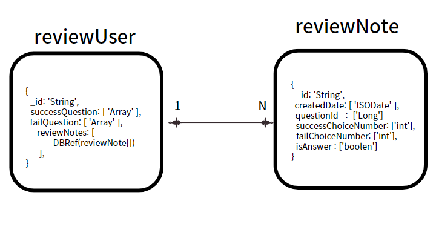
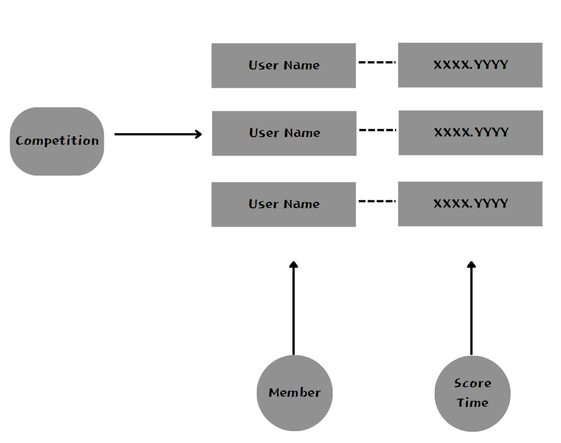

# 📖 취업 CS 걱정하지마, CS;tudy

<p align="center">
  

<br>

## ✨ 프로젝트 소개
``` Introduce ```
- 취업에 있어 필요한 CS 지식을 학습할 수 있는 웹 어플리케이션 플랫폼 입니다. 카테고리 별 문제를 통해 필요한 지식을 빠르게 학습할 수 있으며 틀린 문제를 모아서 부족한 부분을 빠르게 인지할 수 있습니다.  또한 경쟁을 통하여 지루한 CS 학습에 재미를 부여하며 선의의 경쟁을 통해 동료와 함께 성장이 가능합니다.

- [⭐️ 팀 노션](https://sunny-radiator-7f3.notion.site/CStudy-5da03f7b12d5477eae1e35caacd04615?pvs=4) | ~~[📝 배포 사이트 ](https://dbsyacmkozvg1.cloudfront.net/)~~

<br>


<br>

## 💎프로젝트 구조도
```bash
CStudy
├── module-api 
│        ├── application
│        ├── config
│        ├── controller
│        ├── dto # Dto request, response
│        ├── exception # Exception Handler
│        ├── initializer
│        └── util
│ 
├── module-common   
│             └── config
│             └── domain
│             └── dto
│             └── error
│             └── repository
│             └── util
│
│
└── infra
      └── docker
      └── redis
   
```

<br>
<br>

## 👨‍기술 스택

<h3 align="center">어플리케이션</h3>

<p align="center">


</p>


<h3 align="center">DB</h3>

<p align="center">  


</p>

<h3 align="center">인프라</h3>

<p align="center">   


</p>

<h3 align="center">문서 / 협업</h3>

<p align="center">   


</p><br>


<br>

## 🐌Git Commit Convention
<table>
  <tr>
    <td>
         ✨feat
    </td>
     <td>
        새로운 기능과 관련된 것을 의미
    </td>
  </tr>
  <tr>
    <td>
         🐛fix
    </td>
     <td>
        오류와 같은 것을 수정을 하였을 때 사용
    </td>
  </tr>
   <tr>
    <td>
         ✅test
    </td>
     <td>
        테스트를 추가하거나 수정
    </td>
  </tr>
  <tr>
    <td>
         📝docs
    </td>
     <td>
        문서와 관련하여 수정한 부분이 있을 때 사용
    </td>
  </tr>
    <tr>
    <td>
         🔥move
    </td>
     <td>
        파일, 코드의 이동
    </td>
  </tr>
    <tr>
    <td>
         💚build
    </td>
     <td>
         빌드 관련 파일을 수정
    </td>
  </tr>
    <tr>
    <td>
         ♻️refactor
    </td>
     <td>
       코드의 리팩토링을 의미
    </td>
  </tr>
</table>

<br>

## 🎨 ERD Diagram

<p align="center">


</p>


## 📋 API 문서


[https://documenter.getpostman.com/view/23650109/2s9XxztCdN](https://documenter.getpostman.com/view/23650109/2s9XxztChm)

<BR/>


## 🥕 Back-end 기술적 의사결정
<details>

<summary> 본문 확인 (👈 Click) </summary>

### 1. JWT Refresh Token

- 로그인, 로그아웃을 위해 RefreshToken 사용
- Token의 탈취의 보안적인 측면을 고려하여 AccessToken : 15 min , RefreshToken: 7 Day
- 저장의 위치 : Coockie vs LocalStorage
  - 현재 저장의 위치는 LocalStorage에 저장을 하였습니다. 왜냐하면 LocalStorage에 저장하면 구현의 난이도가 쉬워지기 때문에 초기 프로젝트에서 LocalStorage를 선택을 하였습니다.
  - 하지만 보안적인 측면을 생각하면 Coockie에 저장하는 방식이 적합합니다. 왜냐하면 Rest Api의 특성은 상태의 관리를 클라이언트에서 처리를 합니다. LocalStorage에 저장하면 RDB, Redis에 저장을 하여 상태관리를 Server에서 위치를 합니다.
  - XSS, CSRF 보안적인 측면
    - XSS 공격 : Script를 통하여 Token의 탈취의 가능성이 있습니다. Coockie에 Token을 저장하면 HttpOnly를 통하여 스크립트를 통하여 Token의 문제를 방지할 수 있습니다.
    - CSRF 공격 : SameSite, Csrf Token을 통하여 방지를 할 수 있다. SameSite를 사용하면 쿠키를 해당 사이트와 동일한 사이트로만 전송되도록 제한할 수 있습니다. Chrome은 기본적으로 Lax로 설정이 되어져 있습니다.

<br/>

### 2. 성공 및 실패 오답노트 MySQL에서 MongoDB 변경

- 일반 문제를 풀었을 때 성공, 실패의 데이터를 memberQuestion 테이블에 Insert가 됩니다.
- MySQL 에서 특정 회원의 문제 성공 유무를 찾기 위해서는 회원, 문제, 성공 실패 유무를 탐색을 해야된다.
- 데이터 성공 또는 실패를 하였을 때 필연적으로 Null 또는 Default Data를 삽입을 한다
- MongoDB의 Collection의 유연한 데이터 구조로 빠르게 데이터를 접근이 가능하며 가시성이 높아졌다.


<br/>

### 3. 전략 패턴을 사용하여 Param에 따른 서비스 호출 및 개별 컴포넌트 분리

- ```api/email``` , ```api/name```은 이메일, 이름의 중복을 체크하는 로직을 처리한다.
- 각각 추상, 구현체를 구현하기 보다 하나의 인터페이스에 Type을 추가하여 Param에 따라서 서비스를 호출하는 로직 작성
- ```Duplication```, ```Member``` 2부분에서 사용이 되면서 중복적인 코드가 발생
- 개별 컴포넌트로 분리하여 필요한 부분에 의존성을 주입하여 중복적인 코드 제거
```java
@Component
public class DuplicateServiceFinder {

    private final List<DuplicateService>duplicateServices;

    public DuplicateServiceFinder(List<DuplicateService> duplicateServices) {
        this.duplicateServices = duplicateServices;
    }

    public DuplicateResponseDto getVerifyResponseDto(String type, String value) {
        DuplicateService duplicateService = duplicateServices.stream()
                .filter(verifyService -> verifyService.getType().name().equals(type))
                .findAny()
                .orElseThrow(RuntimeException::new);

        return duplicateService.signupDivisionDuplicateCheck(type, value);
    }
}

```

<br/>

### 4. 랭킹 점수는 실시간

- 실시간으로 랭킹의 점수와 랭킹의 불러오는 쿼리의 성능의 부담을 줄이기 위하여 캐싱을 사용을 했습니다.
- 문제를 성공/실패를 하였을 때 캐싱의 정합성을 맞추기 위해서 많은 Write 작업이 발생을 하여 캐싱 오버헤드가 발생을 한다고 생각합니다.
- 기존의 ```@CacheEvict```로 캐싱의 정합성을 맞추기 보다 Redis Pub/Sub으로 분산 환경에서 비동기 캐시 정합성을 맞추게 변경을 하였습니다.

<br/>

### 5. 동일한 점수의 회원의 랭킹 처리
- 동일한 점수를 가진 회원 A,B가 있다면 등수를 처리하는데 문제가 있습니다.
- 해당 회원의 등수를 처리하기 위해 Redis Structure를 Double로 변경
- 기존의 데이터의 구조는  { UserName , Score }에서  { UserName , Score.Time }으로 처리를 하였습니다.



<br/>

### 6. 문제 Bulk Insert의 성능 문제점 Batch Insert 10,000건을 기준으로 1440초 - 15.75 성능 개선
- 문제를 생성하는 로직을 재귀호출을 통하여 대량 문제를 생성하는 로직에서 각 문제가 생성하며 하나의 트랜잭션을 차지하여 10,000건을 기준으로 1440초 발생
- 성능적인 문제를 해결하기 위하여 하나의 트랜잭션으로 처리하는 Batch Insert 적용

```java
@Override
    @Transactional
    public void recursiveCreateQuestionChoice(List<CreateQuestionAndCategoryRequestDto> requestDtos) {
        String questionSql = "INSERT INTO question (category_id, question_description, question_explain, question_title) " +
                "VALUES (?, ?, ?, ?)";

        String choiceSql = "INSERT INTO choice (answer, content, choice_number, question_id) " +
                "VALUES (?, ?, ?, ?)";

        jdbcTemplate.batchUpdate(questionSql, new BatchPreparedStatementSetter() {
            @Override
            public void setValues(@NotNull PreparedStatement preparedStatement, int i) throws SQLException {
                CreateQuestionAndCategoryRequestDto questionDto = requestDtos.get(i);

                Long categoryId = getCategoryIdByTitle(questionDto.getCategoryRequestDto().getCategory());

                preparedStatement.setLong(1, categoryId);
                preparedStatement.setString(2, questionDto.getCreateQuestionRequestDto().getQuestionDesc());
                preparedStatement.setString(3, questionDto.getCreateQuestionRequestDto().getQuestionExplain());
                preparedStatement.setString(4, questionDto.getCreateQuestionRequestDto().getQuestionTitle());
            }

            @Override
            public int getBatchSize() {
                return requestDtos.size();
            }
        });


        for (CreateQuestionAndCategoryRequestDto questionDto : requestDtos) {
            Long questionId = getQuestionIdByTitle(questionDto.getCreateQuestionRequestDto().getQuestionTitle());

            List<CreateChoicesAboutQuestionDto> choiceDtos = questionDto.getCreateChoicesAboutQuestionDto();

            jdbcTemplate.batchUpdate(choiceSql, new BatchPreparedStatementSetter() {
                @Override
                public void setValues(@NotNull PreparedStatement preparedStatement, int i) throws SQLException {
                    CreateChoicesAboutQuestionDto choiceDto = choiceDtos.get(i);
                    boolean answer = isCollectAnswer(choiceDto.getAnswer());

                    preparedStatement.setBoolean(1, answer);
                    preparedStatement.setString(2, choiceDto.getContent());
                    preparedStatement.setInt(3, choiceDto.getNumber());
                    preparedStatement.setLong(4, questionId);
                }

                @Override
                public int getBatchSize() {
                    return choiceDtos.size();
                }
            });
        }
    }

    private Long getCategoryIdByTitle(String categoryTitle) {
        String sql = "SELECT category_id FROM category WHERE category_title = ?";
        return jdbcTemplate.queryForObject(sql, Long.class, categoryTitle);
    }

    private Long getQuestionIdByTitle(String questionTitle) {
        String sql = "SELECT question_id FROM question WHERE question_title = ?";
        return jdbcTemplate.queryForObject(sql, Long.class, questionTitle);
    }
```
<br/>

### 7. 실행 계획 분석을 통한 인덱스 추가 및 QueryDSL 페이징 쿼리 튜닝 (10,000건을 기준으로 58.20% 개선) 

- 실행계획을 통하여 페이징 쿼리를 조회를 하였을 때 3개의 테이블이 Type ALL로 Full Scan을 하여 효율적인 검색을 하지 못함
- 인덱스를 추가하여 Type를 ```ref, eq_ref```로 변경하여 커버링 인덱스 적용.
- 카테고리를 조회하는 쿼리를 서브쿼리에서 Dto를 추가시켜 동등 조인으로 변경
<br/>

### 8. 횡단 관심사 분리 (Feat. HandlermethodArgumentResolver, AOP)

- 사용자의 정보를 Security Context Holder에 접근하여 사용자의 Id를 접근하는 중복적인 로직이 발생
- ```HandlermethodArgumentResolver```를 사용하여 Controller 객체 바인딩을 통하여 중복적인 코드 제거
- 특정 게시글의 Write 사용자의 권한을 체크하는 횡단 관심사를 분리하기 위하여 AOP 적용
- Parameter에 순서에 따른 JoinPoint를 설정하여 권한을 체크하는 로직 작성

<br/>

### 9. 추상 클래스를 통한 Exception 응집도 증가 및 Custom Error Status

- ```Runtime Exception```을 상속받는 Custom Exception의 수가 많아지면서 작성의 실수 및 Handler Exception의 코드 가독성이 떨어짐
- 도메인에 따른 추상 클래스를 작성하여 Handler Exception은 추상 클래스만 관리하여 코드의 가독성 증가
- 상태의 코드를 400, 500..보다는 프론트와 협업을 위해 직관적인 Status Code를 작성

<br/>

### 10. Swagger
- 팀 간 효율적인 소통을 위해 도입
- API를 문서화하여 구조와 기능을 쉽게 이해
- 테스트 가능한 사용자 인터페이스 제공
- API 호출을 직접 실행해보며 결과를 확인할 수 있어 테스트 및 디버깅 과정이 효율적으로 진행

<br/>

</details>


## 🥃 Wireframe


<details>

<summary> 본문 확인 (👈 Click) </summary>

[📝 Figma 바로가기 ](https://www.figma.com/file/67asFaSpQCu4s2CKAJqxac/Untitled?type=design&node-id=0-1&mode=design&t=DdRtY5ictOvnNkSn-0)


</details>


## 🏛️ CI/CD 아키텍처 (배포 자동화)


<details>

<summary> 본문 확인 (👈 Click) </summary>


</details>


## ✍️ 프로젝트 종료 이후 혼자서 진행한 리팩토링
<details>

<summary> 본문 확인 (👈 Click) </summary>


</details>
